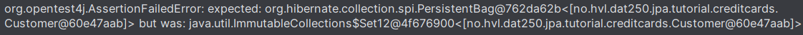

# DAT250 Expass 4

## Progress:
- Done experiment 1 alongside the optional task.
- Stuck on experiment 2 with the bidirectional many-to-many relationship between Address and Customer not operating as intended.

## Technical Issues:
- Did not encounter any issues with installation.
- Had issue with running Main after gradle run, was due to outdated Java JDK version. Fixed by changing to newer JDK.
- Encountered an error with JPA testing with two identical objects being differentiated by different classes that caused an AssertionFailedError in CreditCardsMainTest. Firstly I thought it could be fixed by overriding equals or toString-method for the objects (in this case Address and Customer), however the circumstances remained the same:
- 

## Experiment 2:
- Address: https://github.com/Mantonio02/dat250-jpa-tutorial/blob/master/src/main/java/no/hvl/dat250/jpa/tutorial/creditcards/Address.java.
- Bank: https://github.com/Mantonio02/dat250-jpa-tutorial/blob/master/src/main/java/no/hvl/dat250/jpa/tutorial/creditcards/Bank.java.
- CreditCard: https://github.com/Mantonio02/dat250-jpa-tutorial/blob/master/src/main/java/no/hvl/dat250/jpa/tutorial/creditcards/CreditCard.java.
- Customer: https://github.com/Mantonio02/dat250-jpa-tutorial/blob/master/src/main/java/no/hvl/dat250/jpa/tutorial/creditcards/Customer.java.
- Pincode: https://github.com/Mantonio02/dat250-jpa-tutorial/blob/master/src/main/java/no/hvl/dat250/jpa/tutorial/creditcards/Pincode.java.
- CreditCardsMain: https://github.com/Mantonio02/dat250-jpa-tutorial/blob/master/src/main/java/no/hvl/dat250/jpa/tutorial/creditcards/driver/CreditCardsMain.java.

## Observation:
- The used database consists of Address, Customer, CreditCard, Pincode and Bank. Their relationships are as follows:
  - Address <-> Customer : Many-to-Many (bidirectional). 
  - Customer -> CreditCard : Many-to-Many.
  - CreditCard -> Pincode : Many-to-One.
  - CreditCard <-> Bank : Many-to-One (bidirectional).
- The database run when a transaction begins after the Entity Manager is set up in the corresponding main class CreditCardsMain. Then, whenever the EM is called upon, it will perform a task upon whatever is given, i.e. em.persist(o), etc.
- The SQL used to create the table Customer is CREATE Table Customer.
- A way I have found to inspect tables being created is through debugging with System.out.println(...);. The use of queries is certainly useful to test specific cases such as finding items containing certain values through the WHERE clause.
- The created tables Address and Customer do not correspond well to my initial thoughts of the exercise.

## Pending Issues:
- As mentioned earlier, I encountered a problem that caused progress for the assignment to halt. This issue has remained since I first encountered it, thus I never managed to complete the second experiment.
- I do not know whether the other objects works as intended for CreditCardsMainTest due to the above issue.